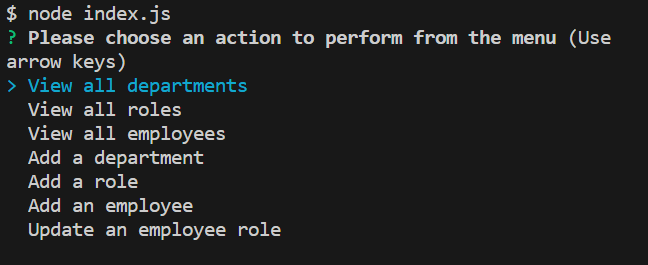
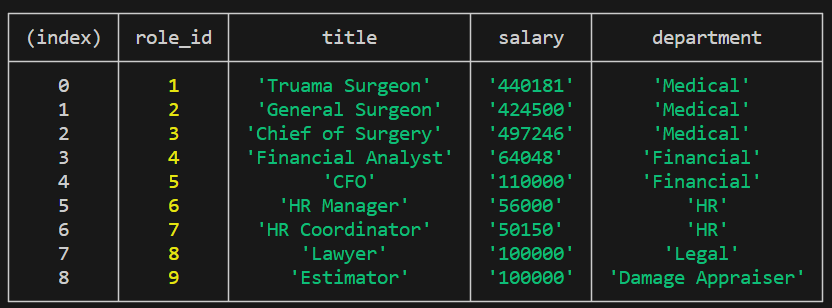
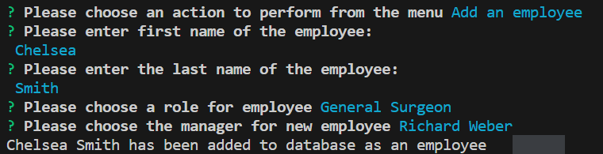

# Employee Tracker
  
  
  ## Description
 This application will allow the user to interact with employee data stored in a database from the command line. 

  The application was created using the following criteria for option on main menu:
  - View all departments: provides a formatted table showing department names and department ids
  - View all roles: provides a formatted table with the job title, role id, the department that role belongs to, and the salary for that role
  - View all employees: provides a formatted table with employee ids, first names, last names, job titles, departments, salaries, and managers that the employees report to
  - Add a department: prompted to enter the name of the department and that department is added to the database
  - Add a role: prompted to enter the name, salary, and department for the role and that role is added to the database
  - Add an employee: prompted to enter the employee’s first name, last name, role, and manager, and that employee is added to the database
  - Update an employee role: prompted to select an employee to update and their new role and this information is updated in the database

  ## Table of Contents
- [Installation](#installation)
- [Usage](#usage)
- [License](#license)
- [Contributing](#contributing)
 
## Installation
In order to use the application node.js will need to be installed.  
Node.js Installation: https://nodejs.org/en/download 

Packages: 
- Inquirer was used to get user input from command line prompts 
- MySQL2 was used to connect to MySQL database and perform queries

## Usage
To use this application open a command terminal and type node index.js. This will connect to the MySQL database and take you to a main menu. Use the keyboard to choose which option you would like to pick. If adding or altering data follow the prompts to complete your action.

Main Menu: 
 
View Roles: 
 
Add Employees: 
 

## License 
MIT License

## Contributing
The following websites were used for reference to create this application: 
SQL Foreign Keys and Recursion
- https://www.w3schools.com/sql/sql_foreignkey.asp 
- https://www.mysqltutorial.org/mysql-foreign-key/ 
- https://medium.com/swlh/recursion-in-sql-explained-graphically-679f6a0f143b 

MySQL Package:
- https://www.npmjs.com/package/mysql2

## Video Walkthrough
[Video Link]()